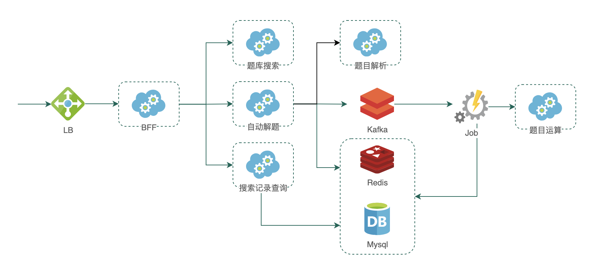

# 项目 - 作业APP
### 业务场景
* 用户输入题目或者拍照上传题目图片，获取题目解题过程和答案
    * 一种直接搜题库，返回题库现有答案
    * 另一种由符号/逻辑运算得到的解题过程和答案
* 用户查看搜索记录，查看题目异步搜索结果

### 架构：

* BFF
  * 搜索接口
    * 搜索记录接口
* 题库搜索服务
  * 图片搜索接口：根据图片从题库搜索答案
* 搜索记录服务
  * 搜索记录接口
  * 生成记录接口
  * 更新记录接口
* 自动解题服务
  * 解题接口：获取题目的解题过程和答案
* 题目解析服务：
  * 解析接口：获取题目文本和所属知识点
* Job
  * 执行解题任务，并更新解题结果
* 题目运算服务
  * 解题接口：根据题目类型和结构化数据，执行符号运算，得到解题过程和答案

